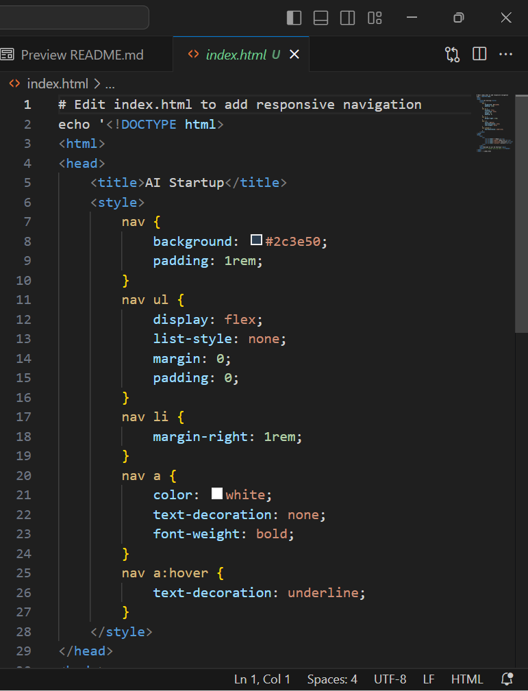

# Git Collaboration: Tom's Workflow Documentation

## Project Context
A team is developing a website for an AI startup using Git for version control. Two developers (Tom and Jerry) need to modify the same `index.html` file simultaneously:

- **Tom's Task**: Update the navigation bar
- **Jerry's Task**: Add-contact-information to the footer

## Prerequisites
- Git installed locally
- Access to central repository(GitHub)
- Clone of the project repository

## Tom's Step-by-Step Workflow

### 1. Fork the project's repository
- Since Tom was only sent the projects URL, his first step was to fork the repository to enable him contribute to the project.


### 2. Initialize Workspace
- Using bash CLI clone the repository and cd into the project directory.
```bash
# This bash command will clone the repository (since have already forked it into Tom's repository)

git clone https://github.com/Ozy-oamen/ai-startup-website.git 
```


- Start from the origin main branch and update Tom's copy of the project with the commands below.
```bash
# The commands below will Ensure Tom start from the origin main branch and have the lastest version of the project.

git checkout main
git pull origin main
```


### 3. Create Feature Branch

- Creating a feature branch will enable Tom add the navigation bar feature with out interferring with the man branch.

```bash
# This command will create a new feature branch "update-navigation".

git checkout -b update-navigation
```


### 4. Make Changes
- Open index.html in your editor

- Modify the navigation bar HTML

- Save the file



### 5. Add changes

- Use the command "git status" and "git add index.html" to check the status of the file, as well as add the file to the staging area.

```bash
# The commands below will do the following to the index.html file.

# Check status 
git status

# Stage Changes
git add index.html
```


### 6. Commit changes

- Use the "git status" command to confirm the index.html file is in the staging area and ready to be commited.
- commit the index.html file for it to be ready to be pushed.

```bash
# Confirm changes is staged
git status

# Commit with descriptive message
git commit -m "feat: Update main navigation with new menu structure"
```


### 7. Push to Remote

```bash
# This bash command will push all the changes to Tom's github repository.
git push -u origin update-navigation
```


### 8. Create Pull Request
- Tom goes to his GitHub repository; He  notices there is a prompt to compare and pull request.
- Tom Clicks on the prompt "Compare and pull request" to request for a new pull request.
- Add PR title: "Navigation Update"
- Add description explaining changes
- Click "Create Pull Request" and Request review from a teammate.

 


### 7. After PR Approval

- Once approved by the team after a pull request is recieved and reviewed by a team mate

- The teammate now merges the PR

- Changes are now in the main branch

- Tom can delete his local branch:


